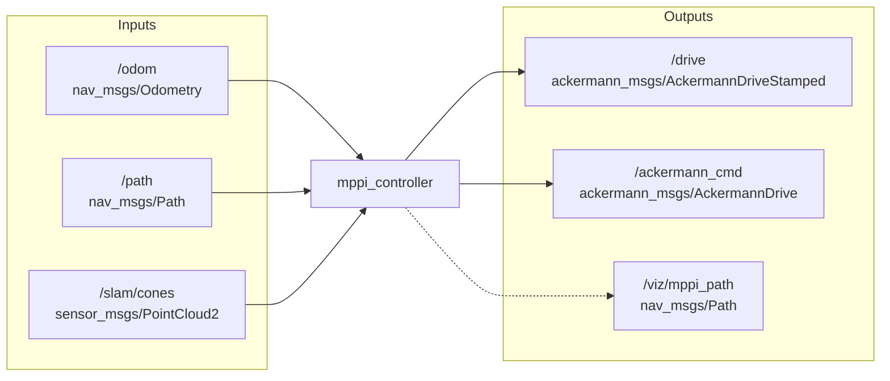

Path following / vehicle control nodes.

## Installation

### Python dependencies
If you use a Python virtual environment in this workspace (as done in [`slam`](../slam/README.md) and [`path_planning`](../path_planning/README.md)), activate it before building/running:

```bash
pip install numpy tf-transformations
```

### Build
Build just this package:

```bash
cd ~/colcon_ws
colcon build --packages-select control
source install/setup.bash
```

# Usage

## MPPI Controller (`mppi_ros_modified.py`)

Model Predictive Path Integral controller that consumes a planned path, odometry, and cone obstacles to publish Ackermann commands.

```bash
ros2 run control mppi_ros_modified.py --ros-args --params-file ~/colcon_ws/src/control/config/mppi_params.yaml -p test_mode:=static_test -p inner_cones_csv:=src/simulation/tracks/mppi_track/inner_cones.csv -p outer_cones_csv:=src/simulation/tracks/mppi_track/outer_cones.csv

```

### ROS Parameters

Most parameters are loaded from the YAML config file. Additional parameters (e.g. for `static_test` mode and mppi_track) are set via command-line `-p` args as shown in the usage example above.

| Parameter | Type | Default | Description |
|-----------|------|---------|-------------|
| **Launch / Static Test** ||||
| `path_topic` | string | `/path` | Topic to subscribe for reference path (ignored when `test_mode=static_test`) |
| `test_mode` | string | (empty) | Set to `static_test` to load inner/outer cone CSVs and auto-generate a static reference path (bypasses /path subscription) |
| `inner_cones_csv` | string | (empty) | Absolute path to inner cones CSV for static_test (see mppi_track example) |
| `outer_cones_csv` | string | (empty) | Absolute path to outer cones CSV for static_test (see mppi_track example) |
| **MPPI Core** ||||
| `dt` | float | 0.05 | Control loop period in seconds (20Hz) |
| `horizon` | int | 12 | Planning horizon in steps (H × dt = 0.6s lookahead) |
| `num_rollouts` | int | 500 | Number of Monte Carlo rollouts (K). More = better sampling but slower |
| `lambda` | float | 2.0 | MPPI temperature. Lower = more aggressive exploitation |
| `sigma_u_base` | float[2] | [0.6, 0.15] | Base noise std dev for [acceleration, steering] |
| `sigma_u_min` | float[2] | [0.2, 0.05] | Minimum noise std dev |
| **Cost Weights** ||||
| `w_path` | float | 40.0 | Weight for path deviation cost |
| `w_heading` | float | 5.0 | Weight for heading error cost |
| `w_speed` | float | 2.0 | Weight for overspeed penalty |
| `w_control` | float | 4.5 | Weight for control effort (smoothness) |
| `w_terminal` | float | 1.0 | Weight for terminal position error |
| `w_obstacle` | float | 150.0 | Weight for obstacle avoidance (high = safety priority) |
| **Vehicle Limits** ||||
| `max_accel` | float | 3.0 | Maximum acceleration in m/s² |
| `min_vel` | float | -1.0 | Minimum velocity in m/s (allows small reverse) |
| `max_vel` | float | 8.0 | Maximum velocity in m/s |
| `max_steer` | float | 0.524 | Maximum steering angle in radians (~30°) |
| **Vehicle Geometry** ||||
| `wheelbase` | float | 1.6 | Distance between front and rear axles in meters |
| **Path Following** ||||
| `search_window` | int | 50 | Number of path points to search for closest point |
| `safety_distance` | float | 0.6 | Minimum safe distance from obstacles in meters |
| `cone_radius` | float | 0.2 | Assumed radius of cone obstacles in meters |
| **Speed Profile** ||||
| `a_lat_max` | float | 2.0 | Maximum lateral acceleration for curvature-based speed limits |
| `v_max_straight` | float | 7.0 | Maximum speed on straight sections in m/s |
| `v_min` | float | 1.0 | Minimum reference speed (prevents stalling in sharp turns) |
| **Noise Smoothing** ||||
| `alpha` | float | 0.5 | Exponential smoothing for noise correlation (0=uncorrelated, 1=fully correlated) |

# Interface



| Topic | Type | Direction | Description |
|-------|------|-----------|-------------|
| `/odom` | `nav_msgs/Odometry` | Input | Vehicle pose and velocity from odometry |
| `/path` | `nav_msgs/Path` | Input | Reference path to follow (configurable via `path_topic` param) |
| `/slam/cones` | `sensor_msgs/PointCloud2` | Input | Detected cone positions for obstacle avoidance |
| `/drive` | `ackermann_msgs/AckermannDriveStamped` | Output | Primary drive command with timestamp |
| `/ackermann_cmd` | `ackermann_msgs/AckermannDrive` | Output | Ackermann command (alternative interface) |
| `/viz/mppi_path` | `nav_msgs/Path` | Output | (Optional) Visualization of planned trajectory |
