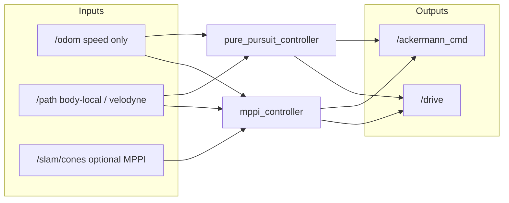

Path following / vehicle control nodes.

## Frame contract (local / velodyne)

`track_pathfinder` publishes `/path` with `frame_id=velodyne` and treats the car as the origin
(+x forward). Both controllers default to **local-frame mode**:

| Topic | Role |
|-------|------|
| `/path` | Body-relative centreline (do **not** transform to odom) |
| `/odom` | **Speed only** (`twist.linear.x`); pose is ignored when `use_local_frame:=true` |
| Planner state | Always `(x, y, θ) = (0, 0, 0)`, `v` from odom |
| `/ackermann_cmd` | Body-frame speed + steering → sim / VCU |

Set `use_local_frame:=false` on MPPI only if you intentionally feed an **odom-frame** path
(e.g. `perfect_path` on `mppi_track`). Pure pursuit supports local frame only.

## Installation

### Python dependencies
If you use a Python virtual environment in this workspace (as done in [`slam`](../slam/README.md) and [`path_planning`](../path_planning/README.md)), activate it before building/running:

```bash
pip install numpy tf-transformations
```

### Build
```bash
cd ~/colcon_ws
colcon build --packages-select control
source install/setup.bash
```

## Controllers

### 1. MPPI (`mppi_ros_modified.py`) — node name `mppi_controller`

Model Predictive Path Integral controller.

```bash
ros2 run control mppi_ros_modified.py --ros-args \
  --params-file $(ros2 pkg prefix control)/share/control/config/mppip.yaml \
  -p use_sim_time:=true
```

### 2. Pure pursuit (`pure_pursuit.py`) — node name `pure_pursuit_controller`

Geometric pure pursuit on the same local `/path` contract (last-year-style baseline).

```bash
ros2 run control pure_pursuit.py --ros-args \
  --params-file $(ros2 pkg prefix control)/share/control/config/ppp.yaml \
  -p use_sim_time:=true
```

### Side-by-side test with pathfinder

From the colcon overlay. See [`tmux/README.md`](../tmux/README.md).

```bash
cd ~/colcon_ws
./tmux/startup.sh            # default CONTROLLER=pp, EVENT=mppi_track
CONTROLLER=mppi ./tmux/startup.sh
```

With `CAN=1` (default) the controller is remapped to `/ackermann_cmd_planner`. [`mission_supervisor`](../mission_supervisor/README.md) forwards that to `/ackermann_cmd_controller` **only while AS_DRIVING**.

## ROS Parameters (MPPI)

Most parameters are loaded from `config/mppi_params.yaml`.

| Parameter | Type | Default | Description |
|-----------|------|---------|-------------|
| **Frame** ||||
| `use_local_frame` | bool | `true` | Vehicle pose forced to origin; path is body-relative |
| `path_frame` | string | `velodyne` | Expected `/path` frame (warns if mismatched) |
| `path_topic` | string | `/path` | Reference path topic |
| **MPPI Core** ||||
| `dt` | float | 0.05 | Control loop period (s) |
| `horizon` | int | 12 | Planning horizon steps |
| `num_rollouts` | int | 500 | Monte Carlo rollouts |
| `lambda` | float | 2.0 | MPPI temperature |
| `sigma_u_base` | float[2] | [0.6, 0.15] | Noise std [accel, steer] |
| **Cost Weights** ||||
| `w_path` / `w_heading` / `w_speed` / `w_control` / `w_terminal` / `w_obstacle` | float | see yaml | Cost terms |
| **Limits** ||||
| `max_accel` / `min_vel` / `max_vel` / `max_steer` | float | see yaml | Vehicle limits |
| `wheelbase` | float | 1.6 | Wheelbase (m) |
| **Speed profile** ||||
| `a_lat_max` / `v_max_straight` / `v_min` | float | see yaml | Curvature-limited v_ref |

## ROS Parameters (Pure pursuit)

Loaded from `config/pure_pursuit_params.yaml`.

| Parameter | Default | Description |
|-----------|---------|-------------|
| `use_local_frame` | `true` | Required true (body-relative path) |
| `lookahead_distance` | `3.0` | Lookahead Ld (m) |
| `wheelbase` | `1.6` | L for δ = atan2(2 L sin α, Ld) |
| `max_steer` | ~30° | Steering clamp (rad) |
| `target_speed` | `3.0` | Used if curvature speed disabled |
| `use_curvature_speed` | `true` | Use PathProcessor speed profile |
| `min_speed` / `max_speed` | 1.0 / 6.0 | Speed clamps |

# Interface



| Topic | Type | Direction | Description |
|-------|------|-----------|-------------|
| `/odom` | `nav_msgs/Odometry` | Input | Speed (`twist.linear.x`); pose ignored in local mode |
| `/path` | `nav_msgs/Path` | Input | Body-relative path from track_pathfinder |
| `/slam/cones` | `sensor_msgs/PointCloud2` | Input | Optional MPPI obstacles |
| `/drive` | `ackermann_msgs/AckermannDriveStamped` | Output | Stamped drive command |
| `/ackermann_cmd` | `ackermann_msgs/AckermannDrive` | Output | Sim / VCU command |
| `/viz/pure_pursuit_lookahead` | `nav_msgs/Path` | Output | PP lookahead segment (local) |
